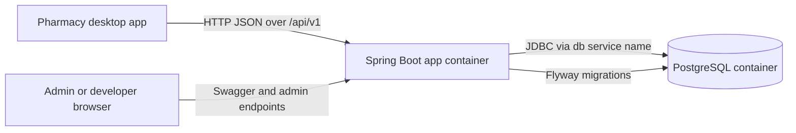
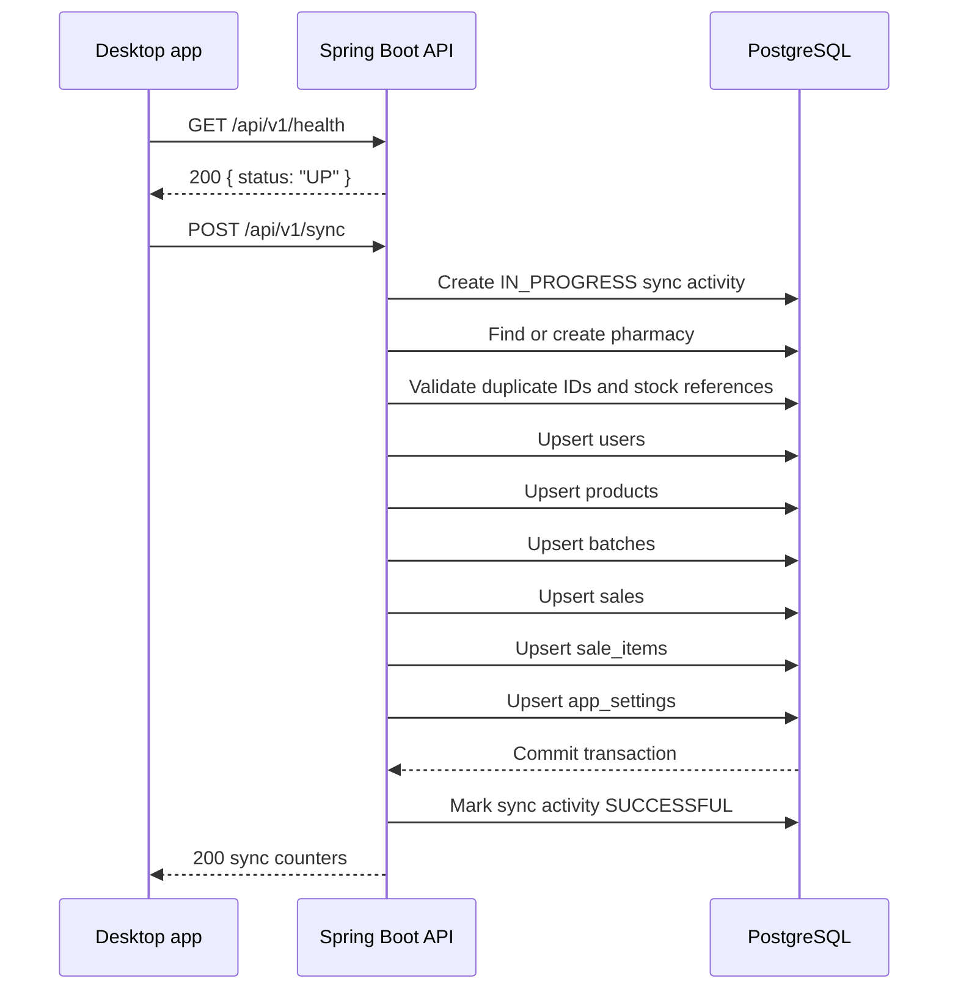

# Architecture And Flow

Last updated: 2026-07-28.

## Runtime View

The default local runtime is Docker Compose. Compose starts PostgreSQL first, waits for it to become healthy, then starts the Spring Boot API.



Services:

| Service | Compose name | Container name | Purpose |
| --- | --- | --- | --- |
| Spring Boot API | `app` | `pharmacy-server` | Versioned API, sync processing, admin reporting. |
| PostgreSQL | `db` | `pharmacy-db` | Persistent storage for synced and reporting data. |

## Application Layers

```text
Controllers -> Services -> Repositories -> JPA entities -> PostgreSQL
```

| Layer | Package | Responsibility |
| --- | --- | --- |
| HTTP controllers | `controller` | Expose versioned `/api/v1` endpoints and Swagger annotations. |
| DTOs | `dto` | Define request and response contracts. |
| Services | `service` and `service.impl` | Sync transaction logic and admin reporting logic. |
| Repositories | `repository` | Spring Data access to tables. |
| Entities | `entity` | JPA mappings validated against Flyway schema. |
| Migrations | `src/main/resources/db/migration` | Database schema source of truth. |
| Exceptions | `exception` | Convert validation and business failures into consistent JSON errors. |

## Versioned API Boundary

All supported application endpoints are under `/api/v1`.

`ApiPaths` is the single source for the application route prefixes:

```text
/api/v1/health
/api/v1/sync
/api/v1/admin
```

Spring Security permits those routes and denies everything else, apart from Swagger/OpenAPI routes.

## Sync Sequence



If any validation, relationship, ownership, or database error happens during sync, the transaction rolls back and the desktop must keep its local rows pending.

## Sync Data Ownership

Each sync payload has one top-level `pharmacyId`. The backend scopes every synced row to that pharmacy.

Rules:

- A new pharmacy ID creates a placeholder pharmacy record.
- Existing records can only be updated by the pharmacy that owns them.
- Incoming records win only when `last_updated_at` is newer than the stored value.
- Equal or older incoming records are counted as ignored.
- The backend does not currently process deletions from the desktop; synced rows are stored with `deleted=false` when inserted or updated.

## Stock Reference Architecture

`stock_reference` is the unique stock delivery identifier. It is unique per pharmacy and stable for a specific batch row.

`batch_number` is the manufacturer batch or lot number. Multiple stock deliveries may share the same `batch_number`, so the frontend must not use `batch_number` as the unique identifier.

## Monitoring And Reporting

Admin dashboard, pharmacy list, details, inventory, and sales endpoints read the detailed operational tables written by the desktop sync. Batch rows are the inventory source; sale headers are the sales source. The older `central_inventory` and `central_sales` tables remain in the schema for legacy data compatibility but are not used by the current admin service.

Every validated sync request that reaches the controller gets a `sync_activities` audit row in a separate transaction. It begins as `IN_PROGRESS`, becomes `SUCCESSFUL` only after the complete operational transaction commits, and becomes `FAILED` after a processing failure rolls back. The audit write is best-effort so it cannot change a committed desktop sync from HTTP `200` to a failure.

The frontend discovery flow is:

```text
GET /api/v1/admin/dashboard
GET /api/v1/admin/pharmacies
select a pharmacy in the UI
GET /api/v1/admin/pharmacies/{selectedPharmacyId}
```

The UUID is carried internally after selection and is never entered by the user.

## Security Posture

Current Dockerized local sync accepts `/api/v1/sync` without `X-Pharmacy-Token`. The token authentication service and filter class remain in the codebase for future use, but the filter is dormant.

Before production exposure, add and document:

- HTTPS termination.
- Authentication for sync and admin routes.
- Secret management for database passwords and tokens.
- Backup and restore process for PostgreSQL volume data.

## Documentation Update Rule

When implementation changes, update the affected documentation in the same work item. At minimum, check:

- `README.md`
- `DOCKER.md`
- `docs/api.md`
- `docs/architecture.md`
- `docs/database-schema.md`
- `docs/configuration.md`
- `docs/testing.md`
- `docs/frontend-ui-spec.md`
- Swagger/OpenAPI annotations in controllers and `OpenApiConfig`
