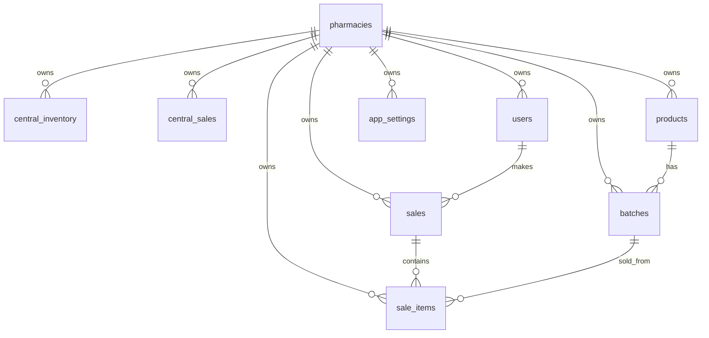

# Database Schema

Last updated: 2026-07-28.

Flyway is the database schema source of truth. Migrations live in:

```text
src/main/resources/db/migration
```

Current migrations:

| Version | File | Purpose |
| --- | --- | --- |
| `V1` | `V1__create_pharmacy_sync_schema.sql` | Creates pharmacies, central reporting tables, and detailed sync tables. |
| `V2` | `V2__add_batch_stock_reference.sql` | Adds `batches.stock_reference`, backfills legacy rows, and creates the per-pharmacy unique index. |
| `V3` | `V3__add_sync_activity.sql` | Adds frontend-facing synchronization attempt history and status counts. |

JPA runs with `spring.jpa.hibernate.ddl-auto=validate`, so Hibernate validates the schema but does not create or alter tables.

## Relationship Overview



`sync_activities.pharmacy_id` intentionally has no foreign key. A failed first sync can be audited even though the operational transaction rolls back the placeholder pharmacy creation.

## Tables

### pharmacies

Stores known pharmacies or placeholder pharmacies created from first sync.

| Column | Type | Notes |
| --- | --- | --- |
| `id` | `uuid` | Primary key. Comes from desktop `pharmacyId` for synced pharmacies. |
| `name` | `varchar(255)` | Placeholder format: `Imported Pharmacy {pharmacyId}`. |
| `location` | `varchar(500)` | Placeholder value: `Unknown`. |
| `api_token` | `varchar(255)` | Unique. Placeholder format: `auto-{pharmacyId}`. Current sync does not require this token. |

Indexes:

```text
ux_pharmacies_api_token(api_token)
```

### central_inventory

Legacy reporting inventory table retained for backward-compatible data storage. Current admin endpoints read detailed `batches` instead.

| Column | Type | Notes |
| --- | --- | --- |
| `id` | `uuid` | Primary key. |
| `pharmacy_id` | `uuid` | Foreign key to `pharmacies`. |
| `product_name` | `varchar(255)` | Reporting product name. |
| `quantity` | `integer` | Quantity used for report totals. |
| `price` | `numeric(14,2)` | Unit price used for inventory value. |
| `last_updated_at` | `timestamp with time zone` | Reporting timestamp. |

No current `/api/v1/admin` endpoint reads this table.

### central_sales

Legacy reporting sales table retained for backward-compatible data storage. Current admin endpoints read detailed `sales` instead.

| Column | Type | Notes |
| --- | --- | --- |
| `id` | `uuid` | Primary key. |
| `pharmacy_id` | `uuid` | Foreign key to `pharmacies`. |
| `total_amount` | `numeric(14,2)` | Sale total. |
| `created_at` | `timestamp with time zone` | Sort field for sales reports. |
| `last_updated_at` | `timestamp with time zone` | Reporting timestamp. |

No current `/api/v1/admin` endpoint reads this table.

### users

Detailed sync user records.

| Column | Type | Notes |
| --- | --- | --- |
| `id` | `uuid` | Primary key from desktop. |
| `pharmacy_id` | `uuid` | Foreign key to `pharmacies`. |
| `username` | `varchar(100)` | Unique per pharmacy. |
| `password_hash` | `varchar(255)` | Sensitive. Do not log full payloads. |
| `role` | `varchar(50)` | Desktop role value. |
| `created_at` | `timestamp with time zone` | Desktop creation time. |
| `last_updated_at` | `timestamp with time zone` | Last-write-wins comparison field. |
| `deleted` | `boolean` | Defaults false. Current sync updates set it false. |

Indexes:

```text
ux_users_pharmacy_username(pharmacy_id, username)
idx_users_pharmacy_id(pharmacy_id)
idx_users_last_updated_at(last_updated_at)
```

### products

Detailed sync product records.

| Column | Type | Notes |
| --- | --- | --- |
| `id` | `uuid` | Primary key from desktop. |
| `pharmacy_id` | `uuid` | Foreign key to `pharmacies`. |
| `name` | `varchar(255)` | Required. |
| `description` | `text` | Optional. |
| `category` | `varchar(120)` | Optional. |
| `reorder_level` | `integer` | Required, non-negative in API validation. |
| `created_at` | `timestamp with time zone` | Desktop creation time. |
| `last_updated_at` | `timestamp with time zone` | Last-write-wins comparison field. |
| `deleted` | `boolean` | Defaults false. Current sync updates set it false. |

### batches

Detailed sync stock delivery records.

| Column | Type | Notes |
| --- | --- | --- |
| `id` | `uuid` | Primary key from desktop. |
| `pharmacy_id` | `uuid` | Foreign key to `pharmacies`. |
| `product_id` | `uuid` | Foreign key to `products`. |
| `stock_reference` | `varchar(64)` | Unique per pharmacy. Added in V2. |
| `batch_number` | `varchar(120)` | Manufacturer batch or lot number. Not unique. |
| `quantity` | `integer` | Required, non-negative in API validation. |
| `cost_price` | `numeric(14,2)` | Required, non-negative in API validation. |
| `selling_price` | `numeric(14,2)` | Required, non-negative in API validation. |
| `expiry_date` | `date` | Optional. |
| `created_at` | `timestamp with time zone` | Set from incoming `last_updated_at` for new batch rows. |
| `last_updated_at` | `timestamp with time zone` | Last-write-wins comparison field. |
| `deleted` | `boolean` | Defaults false. Current sync updates set it false. |

Indexes:

```text
ux_batches_pharmacy_stock_reference(pharmacy_id, stock_reference)
idx_batches_pharmacy_id(pharmacy_id)
idx_batches_product_id(product_id)
idx_batches_expiry_date(expiry_date)
idx_batches_last_updated_at(last_updated_at)
```

### sales

Detailed sync sale header records.

| Column | Type | Notes |
| --- | --- | --- |
| `id` | `uuid` | Primary key from desktop. |
| `pharmacy_id` | `uuid` | Foreign key to `pharmacies`. |
| `user_id` | `uuid` | Foreign key to `users`. |
| `sale_date` | `timestamp with time zone` | Desktop sale time. |
| `total_amount` | `numeric(14,2)` | Required, non-negative in API validation. |
| `created_at` | `timestamp with time zone` | Set from incoming `sale_date` for new sale rows. |
| `last_updated_at` | `timestamp with time zone` | Last-write-wins comparison field. |
| `deleted` | `boolean` | Defaults false. Current sync updates set it false. |

### sale_items

Detailed sync sale line records.

| Column | Type | Notes |
| --- | --- | --- |
| `id` | `uuid` | Primary key from desktop. |
| `pharmacy_id` | `uuid` | Foreign key to `pharmacies`. |
| `sale_id` | `uuid` | Foreign key to `sales`. |
| `batch_id` | `uuid` | Foreign key to `batches`. |
| `product_name` | `varchar(255)` | Snapshot at sale time. |
| `batch_number` | `varchar(120)` | Snapshot at sale time. Not a unique identifier. |
| `quantity_sold` | `integer` | Required, non-negative in API validation. |
| `unit_price` | `numeric(14,2)` | Required, non-negative in API validation. |
| `created_at` | `timestamp with time zone` | Set from incoming `last_updated_at` for new sale item rows. |
| `last_updated_at` | `timestamp with time zone` | Last-write-wins comparison field. |
| `deleted` | `boolean` | Defaults false. Current sync updates set it false. |

### app_settings

Detailed sync application settings.

| Column | Type | Notes |
| --- | --- | --- |
| `id` | `uuid` | Primary key from desktop. |
| `pharmacy_id` | `uuid` | Foreign key to `pharmacies`. |
| `setting_key` | `varchar(150)` | Unique per pharmacy. |
| `setting_value` | `text` | Optional. |
| `created_at` | `timestamp with time zone` | Set from incoming `last_updated_at` for new setting rows. |
| `last_updated_at` | `timestamp with time zone` | Last-write-wins comparison field. |
| `deleted` | `boolean` | Defaults false. Current sync updates set it false. |

### sync_activities

Stores validated synchronization attempts for dashboard and activity APIs.

| Column | Type | Notes |
| --- | --- | --- |
| `id` | `uuid` | Primary key generated by the server. |
| `pharmacy_id` | `uuid` | Desktop pharmacy identifier; deliberately not a foreign key. |
| `status` | `varchar(20)` | `IN_PROGRESS`, `SUCCESSFUL`, or `FAILED`. |
| `started_at` | `timestamp with time zone` | Time processing began. |
| `completed_at` | `timestamp with time zone` | Completion/failure time; null while in progress. |
| `records_received` | `integer` | Total rows submitted across all groups. |
| `records_inserted` | `integer` | Total inserted rows after success. |
| `records_updated` | `integer` | Total strictly-newer updated rows after success. |
| `records_ignored` | `integer` | Total equal/older rows ignored after success. |
| `inventory_records_received` | `integer` | Submitted products plus batches. |
| `inventory_records_applied` | `integer` | Inserted/updated products plus batches. |
| `sales_records_received` | `integer` | Submitted sale headers. |
| `sales_records_applied` | `integer` | Inserted/updated sale headers. |
| `message` | `varchar(1000)` | Frontend-safe status or failure message. |

## Migration Notes

`V2__add_batch_stock_reference.sql` backfills existing batch rows with:

```text
STK-LEGACY-{batchUuidWithoutDashes}
```

This keeps old rows valid while allowing future stock deliveries to use real locally generated stock references.

## Schema Change Rules

When changing entities or sync DTOs:

1. Add a Flyway migration.
2. Update JPA entities and repositories.
3. Update sync validation and service behavior.
4. Update `docs/api.md`, this file, and the frontend spec.
5. Add or update integration tests.
6. Verify with `mvnw clean test` and a Docker Swagger smoke check.
